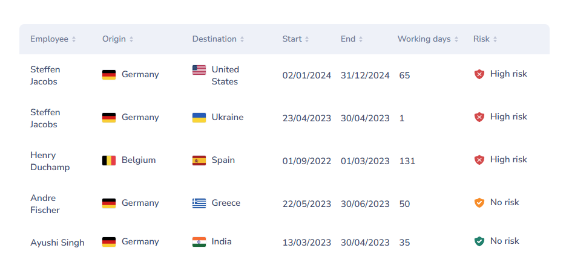

# WorkFlex Workation Platform

Java / Spring Boot API and Angular UI that lists workations in a sortable table.

This repository is a **monorepo**: both apps live under `apps/` and are orchestrated from the root.

```
workflex/
  apps/
    backend/     Spring Boot API  (@workflex/backend)
      src/main/resources/data/workations.csv
    frontend/    Angular UI       (@workflex/frontend)
  scripts/       shared run helpers
  screenshot.png
```



## Features

- `GET /workflex/workation` returns every workation stored in H2
- On startup the backend imports `apps/backend/src/main/resources/data/workations.csv` into the database
- Angular table is sortable by every column
- Dates are shown as `dd/MM/yyyy`
- `LOW` (`LOW_RISK`) and `NO` (`NO_RISK`) both display as **No risk**, with orange and green icons
- Row hover highlight matches the provided screenshot

## Architecture

```
Angular UI  -->  GET /workflex/workation  -->  WorkationController
                                              -->  WorkationService
                                              -->  WorkationRepository (H2)
CSV import  -->  WorkationDataInitializer
            -->  WorkationCsvImporter
```

- **Controller / service / repository** layers keep HTTP, business logic and persistence separate
- The CSV importer is independent of JPA so it can be unit-tested with a `StringReader`
- The Angular app talks to the API through the Angular CLI proxy in development

## Prerequisites

- Java 21+ (the project compiles to Java 21; JDK 25 works)
- Node.js 20+

Maven is not required globally; the backend includes the Maven Wrapper (`mvnw`).

## Run

From the repository root:

```bash
npm install
npm start
```

That starts the API on [http://localhost:8080](http://localhost:8080) and the UI on [http://localhost:4200](http://localhost:4200). The UI proxies `/workflex` to the API.

Run one app only:

```bash
npm run start:api
npm run start:web
```

H2 console (optional): [http://localhost:8080/h2-console](http://localhost:8080/h2-console)  
JDBC URL: `jdbc:h2:mem:workflex`

## Tests

From the repository root:

```bash
npm test
```

Or separately:

```bash
npm run test:api
npm run test:web
```

## Risk mapping

| CSV value            | API enum | UI label   | Colour |
|----------------------|----------|------------|--------|
| `HIGH` / `HIGH_RISK` | `HIGH`   | High risk  | Red    |
| `LOW` / `LOW_RISK`   | `LOW`    | No risk    | Orange |
| `NO` / `NO_RISK`     | `NO`     | No risk    | Green  |
